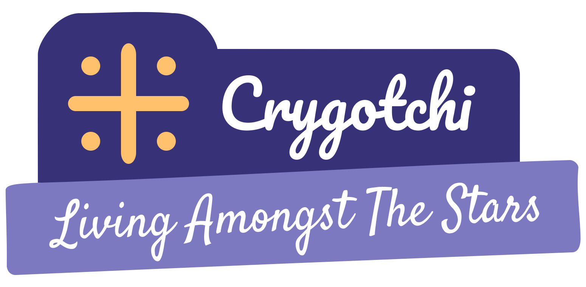

  

&nbsp;

	
	
	
	 
	
	
	

A casual room building, decoration and virtual pet game made in Rust. Only the code is available here; the game data (such as art assets and levels) can only be legally obtained upon purchase of the full game.

This repository lets you‥

- Run the open source code with the commercial data to perform experiments for educational purposes.
- Propose changes to be merged back into the game.
- Create modifications for Crygotchi that would otherwise be impossible.
- Use helpful code snippets in your projects.
- Create your own "total conversions" that use an entirely new set of assets.

If you would like to distribute any of the original Crygotchi assets, you must obtain explicit written permission from CovenFox Studios.

## Technologies used:

- [C# - Programming language](https://github.com/dotnet/csharplang)
- [Godot - Game Engine](https://godotengine.org/)

## Collaborators

Thanks goes to these wonderful people:

- [YMWS - UI Artist](https://twitter.com/ymwspro)
- [Jay_Wolf66 - Concept Artist](https://twitter.com/JayWolf66)
- [Cry - Cry](https://na11t3.carrd.co/)

And all the contributors who helped us out!

<!-- readme: collaborators -start -->
<!-- readme: collaborators -end -->

## Contributors

And all theses contributors that have directly worked on this project's source code:

<!-- readme: contributors -start -->
<!-- readme: contributors -end -->
